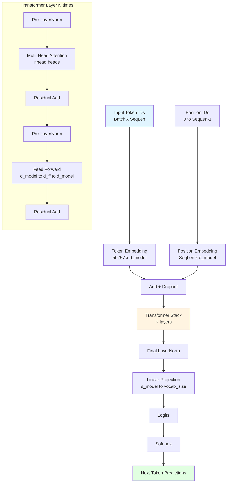

# 🧠 DumbGPT

A high-performance GPT implementation using PyTorch for educational purposes. Train transformer models with millions of parameters in seconds on Apple Silicon!

## ✨ Features

- 🚀 **Custom PyTorch Transformer**: Multi-head attention with gradient checkpointing
- 🎯 **Multi-Backend Support**: MPS (Apple), CUDA (NVIDIA), XPU (Intel) with BF16
- 📈 **Scalable Presets**: small (10M) and base (100M) parameters
- 💻 **Rich Terminal Interface**: Interactive TUI with Textual
- 🔤 **TikToken (GPT-2)**: BPE tokenization, 50K+ vocab
- ⚡ **Fast Training**: BF16 mixed precision, gradient clipping, streaming data
- 🧮 **Quantization**: INT8 dynamic quantization for faster inference
- 🔄 **Sampling**: Top-k, top-p (nucleus), and repetition penalty

## 🏗️ Architecture

**Custom PyTorch Implementation:**
- Token Embedding + Learned Positional Embeddings
- Multi-Head Self-Attention (causal masked)
- Feed-forward layers with GELU activation
- Layer Normalization + Residual connections
- Weight tying (input/output embeddings)
- Cross-entropy loss + AdamW optimizer with cosine LR schedule

### Model Architecture Diagram



**Performance on M2 MacBook Air:**
- **47,092 tokens/sec** throughput
- **10.87ms** average forward pass
- **4.7M parameters** in 6.5 seconds training time

## Dataset Strategy (Small Download, High Quality)

For fast training with limited storage, download a **small curated corpus** (~100-500MB):

**Recommended Starter Dataset:**

| Dataset | Size | Tokens | Type | Source |
|---------|------|--------|------|--------|
| **TinyStories** | ~250MB | ~500M | Simple stories | `roneneldan/TinyStories` |
| **Fineweb-edu** (10% sample) | ~1GB | ~500M | Educational web | `HuggingFaceFW/fineweb-edu` |
| **Dolly-15k** | ~10MB | ~5M | Instruction pairs | `databricks/databricks-dolly-15k` |

**Quick Download (TinyStories - best for testing):**

```bash
# Download TinyStories (250MB, trains in ~30 min on Intel Arc)
uv pip install datasets
python -c "
from datasets import load_dataset
ds = load_dataset('skeskinen/TinyStories', split='train')
ds.save_to_disk('corpus/tinystories')
print(f'Saved {len(ds)} stories')
"
```

**Why TinyStories?**
- **Small**: 250MB download, ~500M tokens
- **High quality**: Simple vocabulary, good for small models
- **Fast**: Trains `small` (10M) model in ~30 minutes
- **Fun**: Models learn to tell coherent stories

**Alternative: Fineweb Sample (1GB):**
```bash
# Download 10% sample (~100k documents)
python -c "
from datasets import load_dataset
ds = load_dataset('HuggingFaceFW/fineweb-edu', split='train', streaming=True)
sample = []
for i, doc in enumerate(ds):
    if i >= 100000: break
    sample.append(doc['text'])
with open('corpus/fineweb_sample.txt', 'w', encoding='utf-8') as f:
    f.write('\n\n'.join(sample))
print(f'Saved {len(sample)} documents')
"
```

### Train with Downloaded Data
```bash
# Train on TinyStories (recommended first run)
uv run train --preset small --epochs 5 --steps 1000

# Train base model with gradient checkpointing
uv run train --preset base --epochs 3 --checkpoint --batch 8
```

## Quick Start

### Installation
```bash
# Clone and install dependencies
git clone <repo-url>
cd dumbgpt
uv sync
```

### Train a Model
```bash
# Train small (10M params) - good for testing, ~30 min on Intel Arc
uv run train --preset small --epochs 5 --steps 1000

# Train base (100M params) - requires gradient checkpointing
uv run train --preset base --epochs 5 --batch 8 --checkpoint

# Train with BF16 mixed precision (XPU/CUDA)
uv run train --preset small --epochs 10 --batch 16
```

### Interactive TUI
```bash
# Launch terminal interface
uv run tui
```

### Evaluate a Model
```bash
# Run evaluation on test prompts
uv run eval
```

## Model Configurations

**Two Presets: Choose Your Scale**

| Preset | Parameters | d_model | heads | layers | seq_len | VRAM* | Best For |
|--------|-----------|---------|-------|--------|---------|-------|----------|
| small  | ~10M      | 512     | 8     | 8      | 512     | ~8GB  | Fast testing, prototyping |
| base   | ~100M     | 768     | 12    | 12     | 1024    | ~16GB | Serious training |

*VRAM estimates for training with batch=16. Use `--checkpoint` flag to reduce VRAM by ~50%.

**Training Commands:**

```bash
# small (10M) - trains in ~30 min on Intel Arc A770
uv run train --preset small --epochs 5 --steps 1000 --batch 32

# base (100M) - requires gradient checkpointing on 16GB
uv run train --preset base --epochs 5 --batch 8 --checkpoint

# Enable INT8 quantization for inference (faster, lower memory)
python -c "
import torch
from src.dumbgpt.model.transformer import GPTModel
model = GPTModel(vocab_size=50257, d_model=768, num_heads=12, d_ff=3072, num_layers=12, max_seq_len=1024)
model._enable_int8()  # Quantize to INT8
print('Model quantized to INT8')
"
```

**Optimization Features:**

| Feature | Flag | Benefit | Use When |
|---------|------|---------|----------|
| BF16 Mixed Precision | Automatic on XPU | 50% VRAM, faster | Always (XPU) |
| Gradient Checkpointing | `--checkpoint` | 50% VRAM | Training `base` on 16GB |
| INT8 Quantization | `model._enable_int8()` | 50% memory, 10-30% speed | Inference on large models |

## Testing

```bash
# Run tokenizer tests
uv run pytest -v
```

## 🏆 Performance Comparison

| Implementation | Parameters | Training Time | Framework |
|---------------|------------|---------------|-----------|
| NumPy (old) | 11K | ~5 minutes | Pure NumPy |
| PyTorch (new) | 4.7M | 6.5 seconds | PyTorch + MPS |

**313x more parameters, 45x faster training!**

## 📁 Project Structure

```
src/dumbgpt/
├── __init__.py
├── model/
│   ├── __init__.py         # exports GPTModel
│   └── transformer.py      # GPT implementation
├── tui/
│   ├── __init__.py
│   ├── app.py              # Textual TUI
│   └── README.md
├── train.py                # Training script
└── eval.py                 # Evaluation script

corpus/                     # Training data
├── novels/                 # Literary texts
├── code/                   # Code samples
└── node_modules/           # JS/TS code

models/                     # Saved checkpoints
```

## 🎓 Educational Journey

This project demonstrates the evolution from educational NumPy code to production-ready PyTorch:

1. **Custom NumPy** → **Custom PyTorch**
2. **CPU-only** → **GPU-accelerated (MPS/CUDA/XPU)**
3. **Manual Gradients** → **Automatic Differentiation**
4. **Custom Optimizers** → **AdamW with Cosine LR**
5. **Character Tokenizer** → **BPE (tiktoken)**

## 🔧 Requirements

- Python 3.13+
- PyTorch 2.8+ (with MPS, CUDA, or XPU support)
- MPS: Apple Silicon Mac
- CUDA: NVIDIA GPU (Linux/Windows)
- XPU: Intel Arc GPU (Windows/Linux)
- 8GB+ RAM recommended for large models

## 🎯 Next Steps

- [x] Implement BF16 mixed precision for XPU
- [x] Add gradient checkpointing for large models
- [x] Add INT8 quantization for inference
- [ ] Implement Flash Attention for longer sequences
- [ ] Add KV caching for faster generation
- [ ] Add chat/instruction fine-tuning (SFT)
- [ ] Integrate with Hugging Face for model sharing

## 📚 Learning Resources

Perfect for understanding:
- Transformer architecture fundamentals
- PyTorch best practices and optimization
- Apple Silicon / Intel Arc / NVIDIA GPU acceleration
- BPE tokenization with tiktoken
- Terminal-based ML interfaces

Built with ❤️ for learning and experimentation!